Modules
-------

The Extension “cachemgm” can be used to analyze caching usages on the website. The extension has two modules: one in Web > Info > Cache Management, one in Tools > Cache Management

Web > Info > Cache Management:
^^^^^^^^^^^^^^^^^^^^^^^^^^^^^^

(Sample images taken from TYPO3.org)

This is how it should look if you expect only ONE cached page per page id:

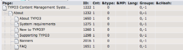

But the typical case for pages with plugins is this:

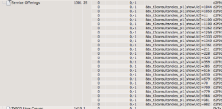

This indicates the for each consultancy listed a cHash value makes the page display cached.

You may also encounter situations like this:

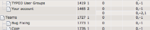

The "Your account" page has two cached instances - one for the non- logged-in user, "0,-1" and one for a logged user "0,-2,1". If users with different group combinations existed or accessed the page you would see additional instances.

Tools > Cache Management:
^^^^^^^^^^^^^^^^^^^^^^^^^

The Tools > Cache Management is meant to show information that doesn't directly related to the page tree. You will also find some of these tests are not directly related to caching; namely DB and file system benchmarking. Sorry about that, this is where they were convenient to put for me at the time of coding.

Global Cache Tables Information
...............................

From TYPO3.org, this is the stats of the cache_hash table.

(Notice: You should not run this test first if you plan to benchmark Sql SELECT speed on the cache_hash table. Reason is; this test will read the WHOLE table since there is no index used. And your benchmark times will be affected since MySQL will cache the requests done to cache_hash)

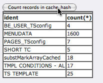

SELECT benchmarks
.................

This will allow you to test the reading speed of records from tables in the database by reading a number of random records from the database using the first row in each index.

The same records will be read three times. In the first pass (Pass1) you can expect a higher number than for the next two reads (Pass2 and Pass3). This is because MySQL or file system will cache. The test works best when the number of records in a table row is higher than the number of records read. Especially if you perform the test multiple times you will get increasingly "better performance" in the first pass because of caching. Ideally your test should start out with a rebooted and non-busy website to make sure no file/db caches are full. Well, you figure...

In the sample below you can see that 100 records are tested on for the PRIMARY key. It takes 1402 ms meaning each record took 1.4 ms to read. Notice how Pass2 and Pass3 are much quicker and generally the same. This shows that MySQL has cached the query result (or some other caching kicks in, maybe in the file system).

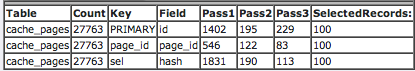

These numbers are from TYPO3.org where the MySQL server is external to the webservers. You may get better performance with less pages and a local MySQL installation.

Here are some other examples from TYPO3.org:

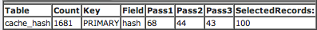
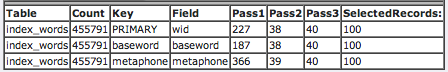
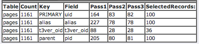
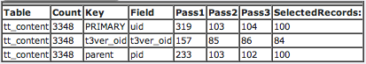

File System Benchmarks
......................

For each directory listed below this test will pick a number of random files and read the full contents of them while measuring the time it takes. This can give you a hint if file access is slow on your system.

The output shows the files read, their size and three columns 0,1,2 which shows the read time for three consecutive read operations. Usually column 0 will contain a higher number than column 1 and 2 which should be the same since the first read (column 0 time) will indicate the performance without the file system cache and read 2 and 3 (Columns 1+2) will indicate the delivery when the file system has cached the file. Also, an average is calculated.

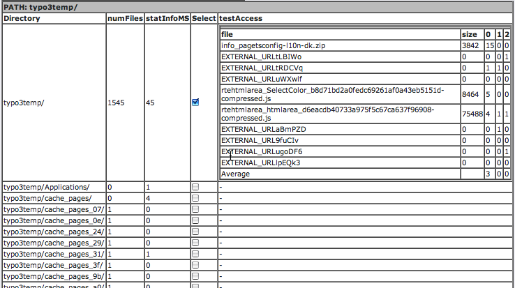

Re-caching your website
-----------------------

If you wish to re-cache your whole website with a command line script this is possible using the “crawler” extension. Of course you could ask “wget” to do that for you. But with the crawler you can specify exact combinations of GET parameters that crawlers may not be intelligent enough to find. Or they may include more than you need.

Re-caching is something you may like to do if you just cleared cache, want to re-cache all pages before your website visitors reaches them - in order to improve their performance. In theory you could also do it if you want to actually update the cache of already cached pages. Normally you don't need this since TYPO3 transparently does it for you for most typical cases. But for tricky cases you may wish to. Or if you disabled automatic cache-clearing.

Anyway, consider this scenario: Only a few pages are cached and they were cached about 3 hours ago:

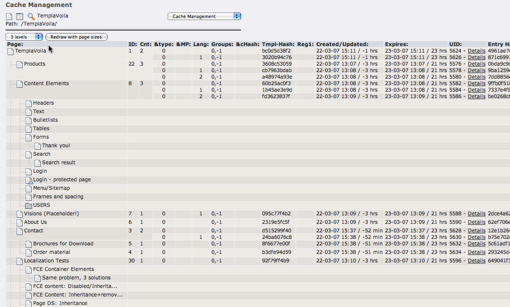

We wish to recache pages from the first page, 2 levels down now.

With the crawler we can do that efficiently from the command line right away:

    /..../typo3/cli_dispatch.phpsh crawler_im 1 -d 2 -proc tx_cachemgm_recache -o exec

- The value “1” after “crawler_im” is the page ID 1 of the “TemplaVoila” page.
- -d 2 means “two levels down”
- -proc tx_cachemgm_recache is the keyword that triggers the “cachemgm” extension to cause re-caching of pages.
- -o exec tells the script to execute it immediately

While processing you will see how the times are updating as the script traverses pages.

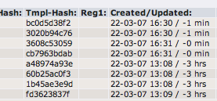

Eventually it looks like this:

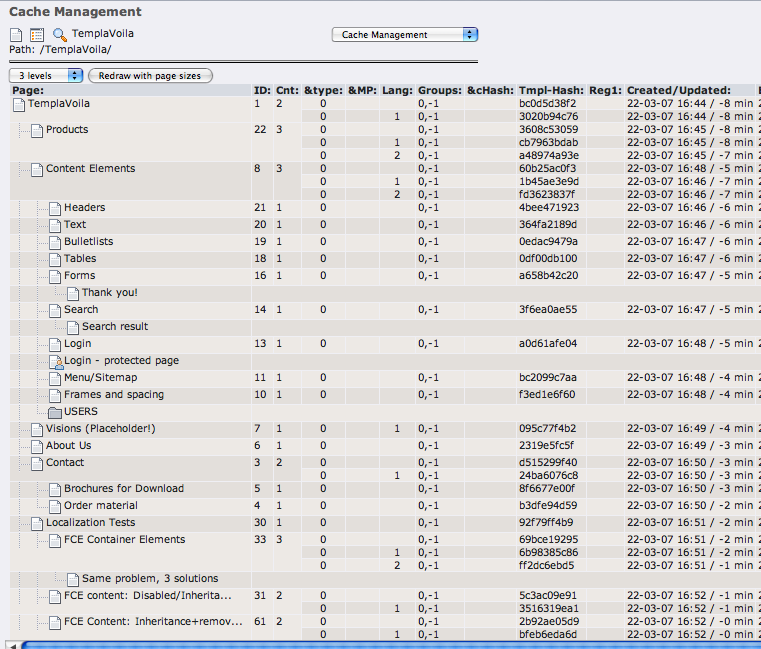

You see all pages are recently cached down to a level of 2 from the root page (for instance the “Thank you!” was not visited!).

The configuration of the crawler that allowed this was:

    tx_crawler.crawlerCfg.paramSets {
      language = &L=[|_TABLE:pages_language_overlay;_FIELD:sys_language_uid]
      language.procInstrFilter = tx_cachemgm_recache
      language.baseUrl = http://localhost:8888/typo3/dummy_4.0/
    }

See more details about the “crawler” in the manual for the “crawler” extension. The “cachemgm” extension is just a third-party extension plugging into the crawler to allow its operation.
