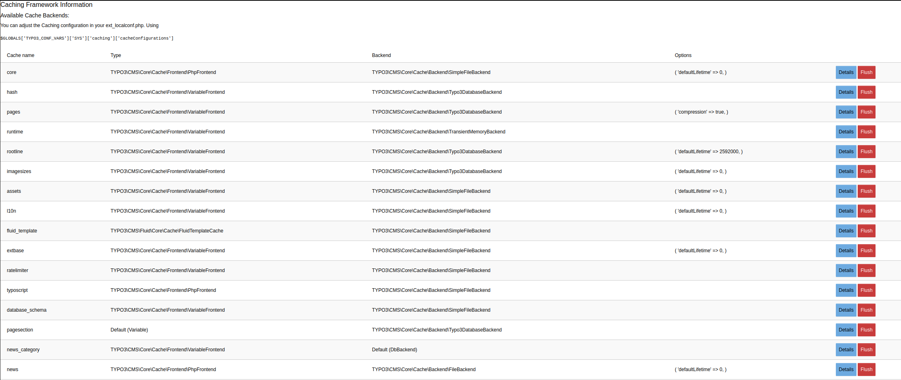
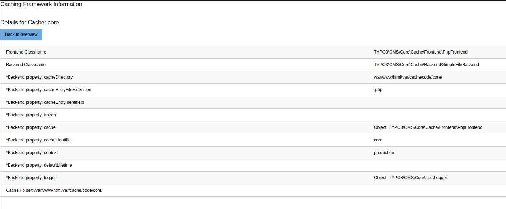

Modules
-------

The Extension “cachemgm” can be used to analyze caching usages on the website.
The extension has one backend module in Tools > Cache Management.

Tools > Cache Management:
^^^^^^^^^^^^^^^^^^^^^^^^^

The Tools > Cache Management is meant to show information that doesn't directly related to the page tree.
You will also find some of these tests are not directly related to caching; namely DB and file system benchmarking.
Sorry about that, this is where they were convenient to put for me at the time of coding.

Index View
..........

The index views shows you a complete overview of all caches configured within
`$GLOBALS['TYPO3_CONF_VARS']['SYS']['caching']['cacheConfigurations']`.
You can see the Type and which cache backend is used.

    Backend Module Index View

Details View
............

On the index view you can click on the details button to the right to get to this view.
In the details view you can see where is stored, which cache backend etc. is used.

    Backend Module Details View

Flush
.....

On the index view you can click on the flush button to clear that one specific cache, a confirmation box will be
displayed before any caches are deleted.

Re-caching your website
-----------------------

If you wish to re-cache your whole website with a command line script this is possible using the “Crawler” extension.
Of course you could ask “wget” to do that for you. But with the Crawler you can specify exact combinations of
GET parameters that crawlers may not be intelligent enough to find. Or they may include more than you need.

Re-caching is something you may like to do if you just cleared cache, want to re-cache all pages before your website visitors
reaches them - in order to improve their performance. In theory you could also do it if you want to actually update the cache
of already cached pages. Normally you don't need this since TYPO3 transparently does it for you for most typical cases.
But for tricky cases you may wish to. Or if you disabled automatic cache-clearing.

We wish to recache pages from the first page, 2 levels down now.

With the Crawler we can do that efficiently from the command line right away:

    /var/www/html/private/vendor/bin/typo3 crawler:buildQueue --depth 2 --mode exec 1 tx_cachemgm_recache

- The value “1” after “--mode exec” is the page UID of the page you want to start from
- --depth 2 means “two levels down”
- --mode exec tells the script to execute it immediately
- "tx_cachemgm_recache" last input, is the configuration that the crawler runs with

The configuration of the Crawler that allowed this was:

Example
=======

..  literalinclude:: _page.tsconfig
    :caption: packages/my_extension/Configuration/Sets/MySet/page.tsconfig

    tx_crawler.crawlerCfg.paramSets {
      language = &L=[|_TABLE:pages_language_overlay;_FIELD:sys_language_uid]
      language.procInstrFilter = tx_cachemgm_recache
      language.baseUrl = http://localhost/
    }

See more details about the Crawler in the manual for the “crawler” extension see, https://docs.typo3.org/p/tomasnorre/crawler/main/en-us/Index.html .
The “cachemgm” extension is a third-party extension plugging into the Crawler to allow its operation.
